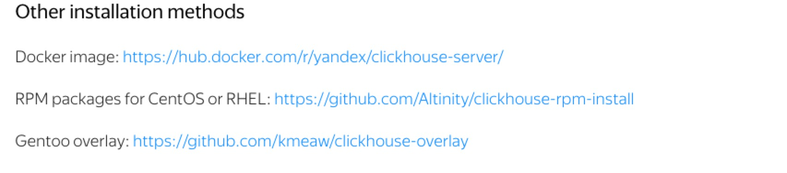

# 前言

clickhouse曾一度支撑着上家公司全球网络监控的落体，其数据量达到20亿+/天，在多维度数据可视化展示、多维度数据分析和多维度数据告警表现优异，
秒杀同时期公司用的其他数据库。多数无益，在这个数据说话的时代，先上一份官网提供的[测试数据](https://clickhouse.yandex/benchmark.html#[%221000000000%22,[%22ClickHouse%22,%22Vertica%22],[%220%22,%221%22]])。
接下来，本文从clickhouse的基础入门、高可用架构搭建和数据多机房迁移方案入手，介绍一下clickhouse，如有说错，欢迎批评指出，一起进步。

# clickhouse高可用集群搭建

## CentOS下rpm包下载
clichhouse官方提供了多种安装方式，包括Ubuntu下apt-get安装、源码安装、Docker安装等，本文只介绍CentOS下rpm安装，其他方式本人比较懒，
等需要用到再补充哈。官方提供的rpm包下载链接如下图：



截至本博客写的时间，rpm包版本更新到[1.1.54362版本](https://packagecloud.io/app/Altinity/clickhouse/search?q=1.1.54362&filter=all&filter=all&dist=el%2F7),
[packagecloud.io](https://packagecloud.io)更新的rpm包比[repo.red-soft.biz](http://repo.red-soft.biz/)的1.1.54236版本更新，
主要特点是可支持按天来做分区。下载

[clickhouse-client-1.1.54362-1.el7.x86_64.rpm](https://packagecloud.io/Altinity/clickhouse/packages/el/7/clickhouse-client-1.1.54362-1.el7.x86_64.rpm)

[clickhouse-debuginfo-1.1.54362-1.el7.x86_64.rpm](https://packagecloud.io/Altinity/clickhouse/packages/el/7/clickhouse-debuginfo-1.1.54362-1.el7.x86_64.rpm)

[clickhouse-server-1.1.54362-1.el7.x86_64.rpm](https://packagecloud.io/Altinity/clickhouse/packages/el/7/clickhouse-server-1.1.54362-1.el7.x86_64.rpm)

[clickhouse-server-common-1.1.54362-1.el7.x86_64.rpm](https://packagecloud.io/Altinity/clickhouse/packages/el/7/clickhouse-server-common-1.1.54362-1.el7.x86_64.rpm)

[clickhouse-test-1.1.54362-1.el7.x86_64.rpm](https://packagecloud.io/Altinity/clickhouse/packages/el/7/clickhouse-test-1.1.54362-1.el7.x86_64.rpm)

一键下载脚本如下：
```shell
wget --content-disposition https://packagecloud.io/Altinity/clickhouse/packages/el/7/clickhouse-client-1.1.54362-1.el7.x86_64.rpm/download.rpm
wget --content-disposition https://packagecloud.io/Altinity/clickhouse/packages/el/7/clickhouse-debuginfo-1.1.54362-1.el7.x86_64.rpm/download.rpm
wget --content-disposition https://packagecloud.io/Altinity/clickhouse/packages/el/7/clickhouse-server-1.1.54362-1.el7.x86_64.rpm/download.rpm
wget --content-disposition https://packagecloud.io/Altinity/clickhouse/packages/el/7/clickhouse-server-common-1.1.54362-1.el7.x86_64.rpm/download.rpm
wget --content-disposition https://packagecloud.io/Altinity/clickhouse/packages/el/7/clickhouse-test-1.1.54362-1.el7.x86_64.rpm/download.rpm
```
下载完这五个rpm包，即可开始我们的搭建工作了。

## 安装依赖包
clickhouse所需要的依赖包非常非常少，命令如下：
```shell
yum -y install libicu-devel unixODBC libtool-ltdl
```

## 安装clickhouse的rpm包
```shell
yum -y install libicu-devel unixODBC libtool-ltdl
```

## 修改启动脚本
如果想根据自己需要指定clickhouse的data、log的路径，需要做这一步操作
```shell
# 默认配置文件位置
root@localhost.localdomain:/  # ls /etc/clickhouse-server
config-preprocessed.xml  config.xml  server-test.xml  users-preprocessed.xml  users.xml

# 上述文件定义了默认数据目录，临时目录位置，日志目录
/var/lib/clickhouse
/var/lib/clickhouse/tmp/
/var/log/clickhouse-server

# 默认启动脚本，注意，这个名字虽然叫server，其实是个shell脚本
/etc/rc.d/init.d/clickhouse-server
root@localhost.localdomain:/  # file /etc/rc.d/init.d/clickhouse-server 
/etc/rc.d/init.d/clickhouse-server: POSIX shell script, ASCII text executable, with very long lines

# 最大文件打开数
root@localhost.localdomain:/  # cat /etc/security/limits.d/clickhouse.conf 
clickhouse      soft    nofile  262144
clickhouse      hard    nofile  262144

# 默认crontab目录
/etc/cron.d/clickhouse-server

# 剩下就是/usr/bin下的二进制文件，但其实都是软链接到了clickhouse这个二进制文件
root@localhost.localdomain:/usr/bin  # ll | grep click -i
-rwxr-xr-x  1 root root    90868752 3月  13 04:00 clickhouse
lrwxrwxrwx  1 root root          10 6月  24 16:46 clickhouse-benchmark -> clickhouse
lrwxrwxrwx  1 root root          10 6月  24 16:45 clickhouse-clang -> clickhouse
lrwxrwxrwx  1 root root          10 6月  24 16:46 clickhouse-client -> clickhouse
lrwxrwxrwx  1 root root          10 6月  24 16:46 clickhouse-compressor -> clickhouse
lrwxrwxrwx  1 root root          10 6月  24 16:45 clickhouse-copier -> clickhouse
lrwxrwxrwx  1 root root          10 6月  24 16:46 clickhouse-extract-from-config -> clickhouse
lrwxrwxrwx  1 root root          10 6月  24 16:46 clickhouse-format -> clickhouse
lrwxrwxrwx  1 root root          10 6月  24 16:45 clickhouse-lld -> clickhouse
lrwxrwxrwx  1 root root          10 6月  24 16:46 clickhouse-local -> clickhouse
lrwxrwxrwx  1 root root          10 6月  24 16:46 clickhouse-performance-test -> clickhouse
lrwxrwxrwx  1 root root          10 6月  24 16:45 clickhouse-server -> clickhouse
-rwxr-xr-x  1 root root       18898 3月  12 22:12 clickhouse-test
-rwxr-xr-x  1 root root        2101 3月  12 22:12 clickhouse-test-server
```
修改 /etc/rc.d/init.d/clickhouse-server,将数据文件和日志文件统一管理,注意下目录的用户权限
```markdown
CLICKHOUSE_LOGDIR=/data0/logs/clickhouse-server
CLICKHOUSE_DATADIR_OLD=/data0/dbData/clickhouse
```
修改/etc/clickhouse-server/config.xml,
```xml
<!-- 因为服务器只支持ipv4. -->
<listen_host>0.0.0.0</listen_host>

<!-- Path to data directory, with trailing slash. -->
<path>/data0/dbData/clickhouse/</path>

<logger>
    <!-- Possible levels: https://github.com/pocoproject/poco/blob/develop/Foundation/include/Poco/Logger.h#L105 -->
    <level>trace</level>
    <log>/data0/logs/clickhouse-server/clickhouse-server.log</log>
    <errorlog>/data0/logs/clickhouse-server/clickhouse-server.err.log</errorlog>
    <size>1000M</size>
    <count>10</count>
    <!-- <console>1</console> --> <!-- Default behavior is autodetection (log to console if not daemon mode and is tty) -->
</logger>
```

## 创建metrika.xml

metrika.xml配置文件主要配置集群相关信息，下面为配置文件内容

```xml
<yandex>
<clickhouse_remote_servers>
    <devops_shard_one>
     <!-- 集群中有两个shard. -->
        <shard>
            <weight>1</weight>
            <internal_replication>false</internal_replication>
            <!-- clickhouse-1和clickhouse-2互为复制集. -->
            <replica>
                <host>clickhouse-1</host>
                <port>9000</port>
            </replica>
            <replica>
                <host>clickhouse-2</host>
                <port>9000</port>
            </replica>
        </shard>
        <shard>
            <weight>1</weight>
            <internal_replication>false</internal_replication>
             <!-- clickhouse-3和clickhouse-4互为复制集. -->
            <replica>
                <host>clickhouse-3</host>
                <port>9000</port>
            </replica>
            <replica>
                <host>clickhouse-4</host>
                <port>9000</port>
            </replica>
        </shard>
    </devops_shard_one>
</clickhouse_remote_servers>


<zookeeper-servers>
    <node index="0">
        <host>zookeeper-1</host>
        <port>2181</port>
    </node>
    <node index="1">
        <host>zookeeper-2</host>
        <port>2181</port>
    </node>
    <node index="2">
        <host>zookeeper-3</host>
        <port>2181</port>
    </node>
</zookeeper-servers>

<macros>
    <replica>clickhouse-1</replica>
</macros>


<networks>
   <ip>::/0</ip>
</networks>


<clickhouse_compression>
<case>
  <min_part_size>10000000000</min_part_size>
  <min_part_size_ratio>0.01</min_part_size_ratio>
  <method>lz4</method>
</case>
</clickhouse_compression>

</yandex>

```

## 修改clickhouse-server/users.xml

```xml
<?xml version="1.0"?>
<yandex>
    <!-- Profiles of settings. -->
    <profiles>
        <!-- Default settings. -->
        <default>
            <!-- Maximum memory usage for processing single query, in bytes. -->
            <max_memory_usage>10000000000</max_memory_usage>

            <!-- Use cache of uncompressed blocks of data. Meaningful only for processing many of very short queries. -->
            <use_uncompressed_cache>0</use_uncompressed_cache>

            <!-- How to choose between replicas during distributed query processing.
                 random - choose random replica from set of replicas with minimum number of errors
                 nearest_hostname - from set of replicas with minimum number of errors, choose replica
                  with minumum number of different symbols between replica's hostname and local hostname
                  (Hamming distance).
                 in_order - first live replica is choosen in specified order.
            -->
            <load_balancing>random</load_balancing>
        </default>
        <devops>
            <max_rows_to_read>10000000000</max_rows_to_read>
            <max_bytes_to_read>100000000000</max_bytes_to_read>
            <max_rows_to_group_by>1000000000</max_rows_to_group_by>
            <group_by_overflow_mode>any</group_by_overflow_mode>
            <max_rows_to_sort>1000000</max_rows_to_sort>
            <max_bytes_to_sort>1000000000</max_bytes_to_sort>
            <max_result_rows>100000</max_result_rows>
            <max_result_bytes>100000000</max_result_bytes>
            <result_overflow_mode>break</result_overflow_mode>
            <max_execution_time>600</max_execution_time>
            <min_execution_speed>1000000</min_execution_speed>
            <timeout_before_checking_execution_speed>15</timeout_before_checking_execution_speed>
            <max_columns_to_read>25</max_columns_to_read>
            <max_temporary_columns>100</max_temporary_columns>
            <max_temporary_non_const_columns>50</max_temporary_non_const_columns>
            <max_subquery_depth>2</max_subquery_depth>
            <max_pipeline_depth>25</max_pipeline_depth>
            <max_ast_depth>50</max_ast_depth>
            <max_ast_elements>10000</max_ast_elements>
            <readonly>0</readonly>
        </devops>

        <!-- Profile that allows only read queries. -->
        <readonly>
            <readonly>1</readonly>
        </readonly>
    </profiles>

    <!-- Users and ACL. -->
    <users>
        <!-- If user name was not specified, 'default' user is used. -->
        <default>
            <!-- Password could be specified in plaintext or in SHA256 (in hex format).

                 If you want to specify password in plaintext (not recommended), place it in 'password' element.
                 Example: <password>qwerty</password>.
                 Password could be empty.

                 If you want to specify SHA256, place it in 'password_sha256_hex' element.
                 Example: <password_sha256_hex>65e84be33532fb784c48129675f9eff3a682b27168c0ea744b2cf58ee02337c5</password_sha256_hex>

                 How to generate decent password:
                 Execute: PASSWORD=$(base64 < /dev/urandom | head -c8); echo "$PASSWORD"; echo -n "$PASSWORD" | sha256sum | tr -d '-'
                 In first line will be password and in second - corresponding SHA256.
            -->
            <password></password>

            <!-- List of networks with open access.

                 To open access from everywhere, specify:
                    <ip>::/0</ip>

                 To open access only from localhost, specify:
                    <ip>::1</ip>
                    <ip>127.0.0.1</ip>

                 Each element of list has one of the following forms:
                 <ip> IP-address or network mask. Examples: 213.180.204.3 or 10.0.0.1/8 or 2a02:6b8::3 or 2a02:6b8::3/64.
                 <host> Hostname. Example: server01.yandex.ru.
                     To check access, DNS query is performed, and all received addresses compared to peer address.
                 <host_regexp> Regular expression for host names. Example, ^server\d\d-\d\d-\d\.yandex\.ru$
                     To check access, DNS PTR query is performed for peer address and then regexp is applied.
                     Then, for result of PTR query, another DNS query is performed and all received addresses compared to peer address.
                     Strongly recommended that regexp is ends with $
                 All results of DNS requests are cached till server restart.
            -->
            <networks incl="networks" replace="replace">
                <ip>::/0</ip>
            </networks>

            <!-- Settings profile for user. -->
            <profile>default</profile>

            <!-- Quota for user. -->
            <quota>default</quota>
        </default>
        <devops>
            <password>123456</password>
            <networks incl="networks" replace="replace">
                 <ip>::/0</ip>
            </networks>
            <profile>devops</profile>
            <quota>default</quota>
        </devops>

        <!-- Example of user with readonly access. -->
        <readonly>
            <password></password>
            <networks incl="networks" replace="replace">
                <ip>::1</ip>
                <ip>127.0.0.1</ip>
            </networks>
            <profile>readonly</profile>
            <quota>default</quota>
        </readonly>
    </users>

    <!-- Quotas. -->
    <quotas>
        <!-- Name of quota. -->
        <default>
            <!-- Limits for time interval. You could specify many intervals with different limits. -->
            <interval>
                <!-- Length of interval. -->
                <duration>3600</duration>

                <!-- No limits. Just calculate resource usage for time interval. -->
                <queries>0</queries>
                <errors>0</errors>
                <result_rows>0</result_rows>
                <read_rows>0</read_rows>
                <execution_time>0</execution_time>
            </interval>
        </default>
    </quotas>
</yandex>
```

## 启动四个节点的clickhouse服务

```shell
service clickhouse-server start
```

使用select * from system.clusters的sql可以查看集群相关信息，至此，高可用集群搭建完毕。


# clickhouse监控

* clickhouse exporter采集数据点
* Prometheus存储数据点
* Grafana展示数据点

未完待续。。。

