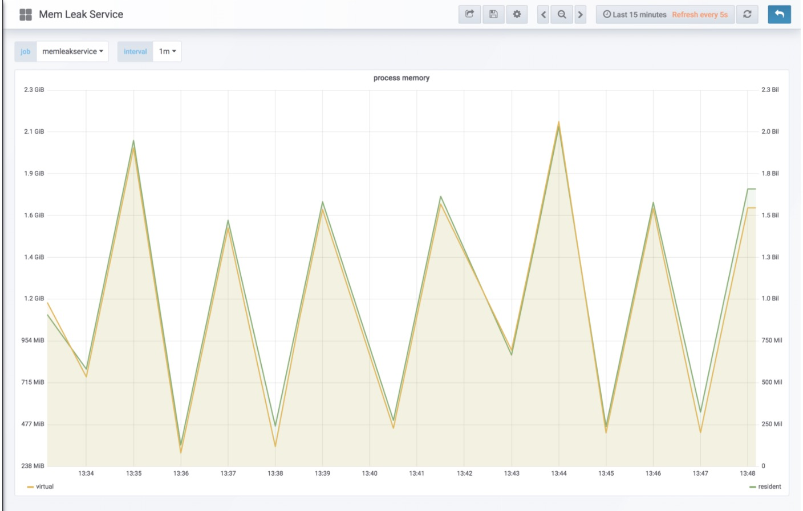

 # 前言
 内存泄露是属于一类bug，表现在应用程序对于不在使用的内存没有进行释放。这类bug通常是明确的，
 高度可见的，使得他们成为开始学习调试的理想选择。Go具有功能强大的工具链，是一种特别适合识别
 内存泄露的语言。该工具链（pprof）具有让人惊讶的功能，可以轻松定位内存的使用情况。
 
# 什么是内存泄露
如果内存无限制地增长而且用于无法达到稳定的状态，则可能存在泄露。这里的关键是内存增长而无法
达到稳定的状态，并最终出现crashes或者影响系统性能而导致问题出现。

内存泄露可能由于多种原因而发生。可以因为数据结构体无限制增长的逻辑泄露，可能因为不良对象引用
处理的复杂性，或者仅仅又由于任何其他原因。无论来源如何，许多内存泄露在数据可视化的展示都会有
锯齿的展示。

# 调试过程
本篇博客重点是探索如何识别和查明内存泄露的根本原因。我们将主要关注内存泄露的特征，如何识别它们
和如何使用go来识别其根本原因。因此，我们的实际调试过程将是相对肤浅和非正式的。

我们分析的目标是通过不断排除可能性来达到逐步缩小问题的范围，直到我们有足够的信息来形成和提出假设。
在我们有足够的数据和原因范围后，我们应该形成假设然后尝试用数据验证假设的正确性。

每一个步骤都是在为了尝试查明问题的原因或者验证假设无效。再次过程我们将形成一系列假设，他们必须
首先是通用的，然后是逐步更具体的。这基于科学的方法。

重新申明我们解决问题的思路：

1. 提出一个问题
2. 形成一个假设
3. 分析这个假设
4. 重复直到找到根本原因

# 鉴定

我们怎么知道否时内存泄露呢？最直接的指标是显示errors。对于内存泄露，常见的错误是OOM错误或显示
系统崩溃

# OOM错误

errors是问题的最明确指标。如果逻辑是闭合的，用户自己生成的errors可能产生误报。OOM是操作系统
字面上表明一些东西使用过多的内存。在下面的错误中，表示达到cgroup限制并且容器被kill。

dmesg
```text
[14808.063890] main invoked oom-killer: gfp_mask=0x24000c0, order=0, oom_score_adj=0                                                                                                                                                 [7/972]
[14808.063893] main cpuset=34186d9bd07706222bd427bb647ceed81e8e108eb653ff73c7137099fca1cab6 mems_allowed=0
[14808.063899] CPU: 2 PID: 11345 Comm: main Not tainted 4.4.0-130-generic #156-Ubuntu
[14808.063901] Hardware name: innotek GmbH VirtualBox/VirtualBox, BIOS VirtualBox 12/01/2006
[14808.063902]  0000000000000286 ac45344c9134371f ffff8800b8727c88 ffffffff81401c43
[14808.063906]  ffff8800b8727d68 ffff8800b87a5400 ffff8800b8727cf8 ffffffff81211a1e
[14808.063908]  ffffffff81cdd014 ffff88006a355c00 ffffffff81e6c1e0 0000000000000206
[14808.063911] Call Trace:
[14808.063917]  [<ffffffff81401c43>] dump_stack+0x63/0x90
[14808.063928]  [<ffffffff81211a1e>] dump_header+0x5a/0x1c5
[14808.063932]  [<ffffffff81197dd2>] oom_kill_process+0x202/0x3c0
[14808.063936]  [<ffffffff81205514>] ? mem_cgroup_iter+0x204/0x3a0
[14808.063938]  [<ffffffff81207583>] mem_cgroup_out_of_memory+0x2b3/0x300
[14808.063941]  [<ffffffff8120836d>] mem_cgroup_oom_synchronize+0x33d/0x350
[14808.063944]  [<ffffffff812033c0>] ? kzalloc_node.constprop.49+0x20/0x20
[14808.063947]  [<ffffffff81198484>] pagefault_out_of_memory+0x44/0xc0
[14808.063967]  [<ffffffff8106d622>] mm_fault_error+0x82/0x160
[14808.063969]  [<ffffffff8106dae9>] __do_page_fault+0x3e9/0x410
[14808.063972]  [<ffffffff8106db32>] do_page_fault+0x22/0x30
[14808.063978]  [<ffffffff81855c58>] page_fault+0x28/0x30
[14808.063986] Task in /docker/34186d9bd07706222bd427bb647ceed81e8e108eb653ff73c7137099fca1cab6 killed as a result of limit of /docker/34186d9bd07706222bd427bb647ceed81e8e108eb653ff73c7137099fca1cab6
[14808.063994] memory: usage 204800kB, limit 204800kB, failcnt 4563
[14808.063995] memory+swap: usage 0kB, limit 9007199254740988kB, failcnt 0
[14808.063997] kmem: usage 7524kB, limit 9007199254740988kB, failcnt 0
[14808.063986] Task in /docker/34186d9bd07706222bd427bb647ceed81e8e108eb653ff73c7137099fca1cab6 killed as a result of limit of /docker/34186d9bd07706222bd427bb647ceed81e8e108eb653ff73c7137099fca1cab6
[14808.063994] memory: usage 204800kB, limit 204800kB, failcnt 4563
[14808.063995] memory+swap: usage 0kB, limit 9007199254740988kB, failcnt 0
[14808.063997] kmem: usage 7524kB, limit 9007199254740988kB, failcnt 0
[14808.063998] Memory cgroup stats for /docker/34186d9bd07706222bd427bb647ceed81e8e108eb653ff73c7137099fca1cab6: cache:108KB rss:197168KB rss_huge:0KB mapped_file:4KB dirty:0KB writeback:0KB inactive_anon:0KB active_anon:197168KB inacti
ve_file:88KB active_file:4KB unevictable:0KB
[14808.064008] [ pid ]   uid  tgid total_vm      rss nr_ptes nr_pmds swapents oom_score_adj name
[14808.064117] [10517]     0 10517    74852     4784      32       5        0             0 go
[14808.064121] [11344]     0 11344    97590    46185     113       5        0             0 main
[14808.064125] Memory cgroup out of memory: Kill process 11344 (main) score 904 or sacrifice child
[14808.083306] Killed process 11344 (main) total-vm:390360kB, anon-rss:183712kB, file-rss:1016kB
```
*问题*：这是一个经常出现的errors吗？

*假设*：OOM错误非常重要，并且很少发生。其中一个进程出现内存泄露

*预测*：否时是内存限制shezhi得太低了，出现了非典型地颠簸或者存在更大得问题

*测试*：经过进一步检查，有相当多的OOM错误表明这是一个严重的问题，而不是一次性的。
检查系统内存的使用情况的可视化图


# 系统内存
确认潜在问题后，下一步就应该了解系统范围内的内存使用情况。内存泄露经常显示为锯齿模式。
尖峰对应于运行的应用程序，而凹陷对应于服务重新启动。

具有锯齿特征的内存泄露，往往是于服务部署相对应。我现在是使用一个项目来说明内存泄露，
但是如果范围缩得足够小，即使是慢速泄露也会看起来像锯齿。在较小得时间范围内，它看起来像是
逐步上升，然后是重启过程时的下降。


上图显示一个内存锯齿问题的实例。内存不断增长，没有平台。这是一个内存泄露的典型实例。

*问题*：哪个或者多个进程导致内存增长？

*测试*：分析每一个进程的内存。 dmesg日志中可能存在一些信息以指示作内存泄露的进程或进程类。

# 每一个进程内存
一旦怀疑内存泄漏，下一步就是确定一个正在贡献或导致系统内存增长的进程。 拥有每个进程历史内存
指标是一项至关重要的要求（基于容器的系统资源可通过cAdvisor等工具获得）。 Go的prometheus
客户端默认提供每个进程内存指标，这是下图获取其数据的位置。

下图显示了一个与上面的系统锯齿内存泄漏图非常相似的过程：在进程重启之前持续增长。


内存是一种关键资源，可以用于指示异常资源的使用情况。此外，拥有内存的使用信息有助于了解如何设置基于
容器的（cgroups）的内存限制。上面图的细节可以找到代码源指标。 在确定了该进程之后，我们需要深入
挖掘并找出代码的哪个特定部分导致此内存增长。

#根本原因分析/来源分析

##Go内存分析
prometheus向我们提供了有关go运行时的详细信息，以及我们的进程正在做什么。 该图表显示在重新启动之前，
字节会不断分配给堆。 每次下降都与服务进程重启相对应。


 
 *问题*：是应用程序那一部分出现内存泄露？
 *假设*：例子中存在内存泄漏，它不断地将内存分配给堆（全局变量或指针，可能通过转义分析可见）。
 *测试*：将内存使用情况和事件相关联。
 
 ##关联工作
 建立关联有助于将问题切分为更小空间来回答：这是在线发生的（与交易相关的）还是发生在后台的。
 
 确定这一点的一种方法是启动服务并让它不运行任何事务负载。服务是否还存在泄露情况。如何还存在泄露，
 那就是框架或共享库存在泄露问题。不过我们的实例是和事务负载强相关。
 
 
 
 上图显示着http请求数量。看趋势是和系统内存增长的时间相匹配的。可以说明我们从HTTP请求处理作为开始分析是对的。
 
 *问题*：那一部分的应用负责堆分配。
 
 *假设*：有一个HTTP处理程序不断地在堆内分配内存。
 
 *测试*：在程序运行期间定期分析堆分配，以跟踪内存增长。
 
 ##GO内存分配
 
为了检查分配了多少内存以及这些分配的来源，我们将使用pprof。 pprof是一个绝对神奇的工具，
也是我使用它的主要原因之一。 为了使用它，我们必须首先启用它，然后设置一些快照。 如果您已经在使用http，
那么启用它只需要下面一句简单的语句：

```go
import _ "net/http/pprof"
```

一旦启用了pprof，我们将在进程内存增长的整个生命周期中定期获取堆快照。 获取堆快照同样重要：

```test
curl http://localhost:8080/debug/pprof/heap > heap.0.pprof
sleep 30
curl http://localhost:8080/debug/pprof/heap > heap.1.pprof
sleep 30
curl http://localhost:8080/debug/pprof/heap > heap.2.pprof
sleep 30
curl http://localhost:8080/debug/pprof/heap > heap.3.pprof
```
 
 目标是了解在程序的整个生命周期中内存的增长情况。 让我们检查一下最新的堆快照：
 
 ```shell
 $ go tool pprof pprof/heap.3.pprof
 Local symbolization failed for main: open /tmp/go-build598947513/b001/exe/main: no such file or directory
 Some binary filenames not available. Symbolization may be incomplete.
 Try setting PPROF_BINARY_PATH to the search path for local binaries.
 File: main
 Type: inuse_space
 Time: Jul 30, 2018 at 6:11pm (UTC)
 Entering interactive mode (type "help" for commands, "o" for options)
 (pprof) svg
 Generating report in profile002.svg
 (pprof) top20
 Showing nodes accounting for 410.75MB, 99.03% of 414.77MB total
 Dropped 10 nodes (cum <= 2.07MB)
       flat  flat%   sum%        cum   cum%
   408.97MB 98.60% 98.60%   408.97MB 98.60%  bytes.Repeat
     1.28MB  0.31% 98.91%   410.25MB 98.91%  main.(*RequestTracker).Track
     0.50MB  0.12% 99.03%   414.26MB 99.88%  net/http.(*conn).serve
          0     0% 99.03%   410.25MB 98.91%  main.main.func1
          0     0% 99.03%   410.25MB 98.91%  net/http.(*ServeMux).ServeHTTP
          0     0% 99.03%   410.25MB 98.91%  net/http.HandlerFunc.ServeHTTP
          0     0% 99.03%   410.25MB 98.91%  net/http.serverHandler.ServeHTTP
 ```
 这绝对是惊人的。 pprof把所有对象在快照时当前在内存中所显示的默认为Type：inuse_space。 
 我们在这里可以看到bytes.Repeat直接占用了我们所有内存的98.60％！
 
 bytes.Repeat的行显示如下：
 
```text
1.28MB  0.31% 98.91%   410.25MB 98.91%  main.(*RequestTracker).Track
```

这看起来很有意思，它表明Track本身有1.28MB或只是占了0.31％，但却占所有使用内存的98.91％! 
更进一步，我们可以看到http使用的内存更少，但是甚至比Track有更大的原因（因为Track是从它调用的）。

pprof提供了许多方法来内省和可视化内存（使用内存大小，使用对象数，分配的内存大小，分配的内存对象），
它允许列出track方法并显示每行负责的程度：

```text
(pprof) list Track
Total: 414.77MB
ROUTINE ======================== main.(*RequestTracker).Track in /vagrant_data/go/src/github.com/dm03514/grokking-go/simple-memory-leak/main.go
    1.28MB   410.25MB (flat, cum) 98.91% of Total
         .          .     19:
         .          .     20:func (rt *RequestTracker) Track(req *http.Request) {
         .          .     21:   rt.mu.Lock()
         .          .     22:   defer rt.mu.Unlock()
         .          .     23:   // alloc 10KB for each track
    1.28MB   410.25MB     24:   rt.requests = append(rt.requests, bytes.Repeat([]byte("a"), 10000))
         .          .     25:}
         .          .     26:
         .          .     27:var (
         .          .     28:   requests RequestTracker
         .          .     29:
```
下面显示的是最直接最精确的根源：

```text
1.28MB   410.25MB     24:   rt.requests = append(rt.requests, bytes.Repeat([]byte("a"), 10000))
```

pprof还允许可视化生成上面的文本信息：
```text
(pprof) svg
Generating report in profile003.svg
```


这清楚地展示当前对象占用进程多少内存。 现在我们已经知道根源的Track，
我们可以验证它是否分配为全局内存然后没有清理，并修复根本问题。

解决方案：内存不断分配给每个HTTP请求的全局变量。

这篇文章只是说明在视觉上识别内存泄漏的能力以及逐步缩小其来源的过程。
最后，我希望它能够触及pprof的强大功能，用于记忆内省和分析。 
一如既往，我会喜欢任何反馈。 谢谢你的阅读。

翻译出处：https://medium.com/dm03514-tech-blog/sre-debugging-simple-memory-leaks-in-go-e0a9e6d63d4d
 
